# Settings

JVM : openjdk:8-jdk-alpine

WAS , Server: Nginx

MYSQL : 5.7

OPENVIDU : 2.19.0

Kurento-media-server : 6.16.0

Node : lts-alpine

Build : Docker, Jenkins


# 자동배포

1. deploy 서버에 Docker 설치 & Gitlab Repository Clone

``` shell
# apt 설치 가능 리스트 및 패키지 업데이트
$ sudo apt update
$ sudo apt upgrade

# 다음 패키지들을 설치 (docker docs 참조)
$ sudo apt install apt-transport-https ca-certificates
$ sudo apt install curl gnupg-agent software-properties-common
# docker의 자동 설치 스크립트를 다운, 실행
# 도커 설치 시에는 기본적으로 관리자 권한이 필요
$ curl -fsSL https://get.docker.com/ | sudo sh
# 도커가 제대로 설치되었는지 확인
$ sudo docker version


git clone https://<your-repository>.git
```


2. 배포서버에 Docker Container로 Jenkins 설치

``` shell
sudo docker run -d \
-u root \
-p 9090:8080 \
--name=jenkins \
-v /jenkins:/var/jenkins_home \
-v /var/run/docker.sock:/var/run/docker.sock \
jenkins/jenkins
```

3. host에서 Jenkins 볼륨을 활용한 Adim PW 확인

``` shell
sudo cat ~/docker/jenkins-data/secrets/initialAdminPassword
```


4.  플러그인 설치

- Jenkins 관리 > 플러그인 관리 > 설치가능

  - GitLab

  - Generic Webhook Trigger

  - Gitlab Authentication

  - Gitlab API

  - Gitlab Merge Request Builder

  - Gitlab Branch Source

  - Blue Ocean

    

  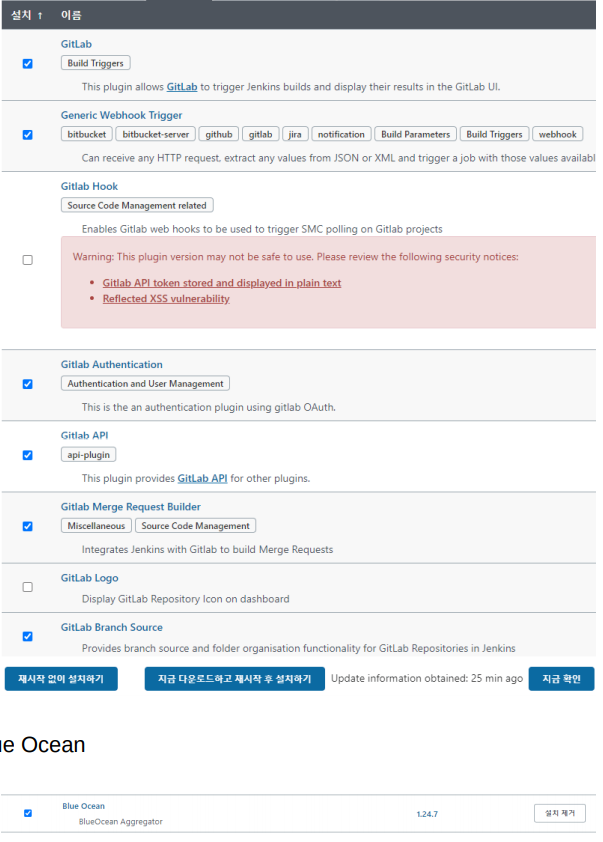

  

  

  

5. 젠킨스 깃랩 연동

- GitLab Access Token 생성

gitlab > settings > Access Tokens를 클릭하고 Name과 Expired at을 지정해준다. 그리고 필요한 Scope를 선택하여 access Token을 생성한 후, 나오는 token 값을 메모(저장)해둔다.

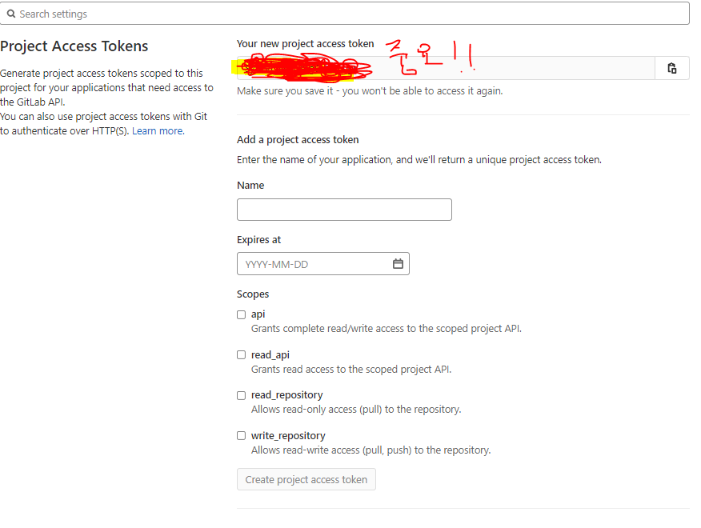

- Jenkins 시스템 설정 > GitLab에서 API Token값에 메모해둔 값을 작성해준다.

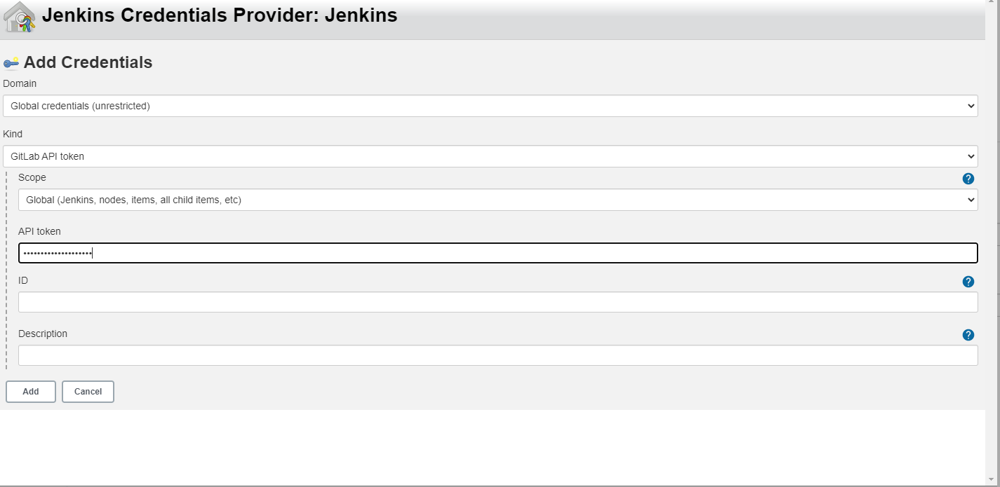

생성 후 Test Connection 클릭후 Success 확인

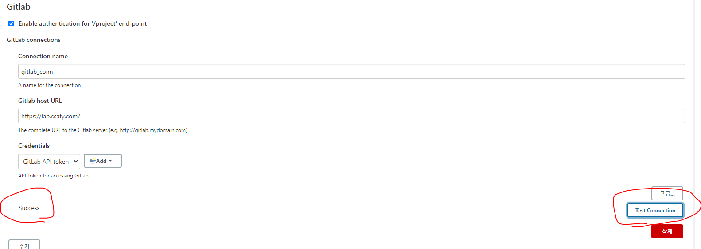


- Jenkins > 새로운 아이템 > Pipeline 선택

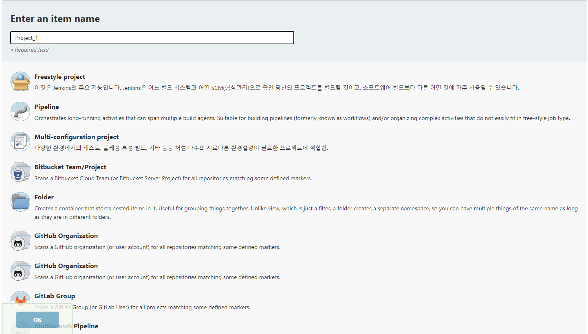

- Pipeline > Definition 중 Pipeline script from SCM 선택 > SCM Git 선택 후 

Repository URL : https://{ID}:{ACCESS TOKEN}@gitlab.com/yourself/yourproject.git

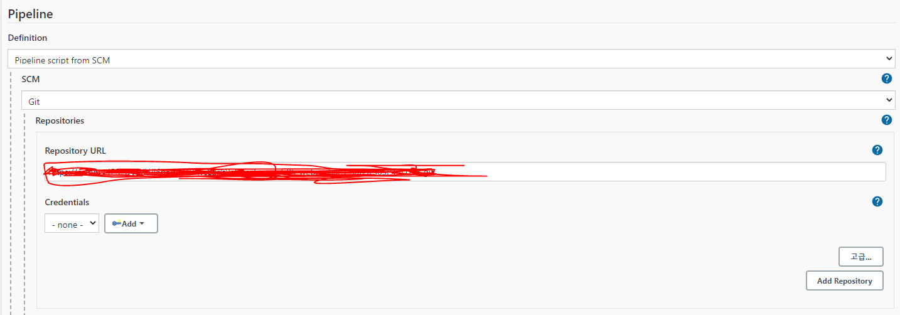

- Script Path 작성후 값 저장


6. 로컬 디렉토리에 Dockerfile과 Jenkinsfile 생성

   6-1. FrontEnd Dockerfile `/frontend/Dockerfile`

```do
# vue.js 프론트 빌드만을 위해 node 이미지를 사용하여 작업하는 과정
### vue.js 빌드만을 위한 node 이미지를 사용
### 작업 디렉토리를 /hompage로 설정한 후,
### 패키지 설치를 위해 package.json을 작업 디렉토리로 옮긴 후 설치
### 나머지 프론트 소스코드와 리소스를 복사하여 빌드 진행
FROM node:lts-alpine as build-stage
WORKDIR /homepage
COPY package*.json ./
RUN npm install
COPY . .
RUN npm run build

# 빌드한 프론트 결과물을 nginx 이미지에 옮겨서 실행하는 과정
### 필요없는 기존 conf 문서를 삭제하고, nginx에 설정하기 위한 conf를 복사
### build-stage(=상위 node 이미지)에서 빌드한 결과물을 nginx로 옮긴 후,
### 80번 포트 개방과 "nginx -g daemon off;" 명령을 실행
FROM nginx:stable-alpine as production-stage
RUN rm /etc/nginx/conf.d/default.conf
COPY ./nginx/homepage.conf /etc/nginx/conf.d/homepage.conf
COPY --from=build-stage ./homepage/dist /usr/share/nginx/html/homepage
COPY ./ssl ./ssl
EXPOSE 8443
CMD ["nginx", "-g", "daemon off;"]
```

​	6-2. Backend Dockerfile `./<project위치>/Dockerfile`

``` do
FROM node:lts-alpine as build-stage
COPY frontend/package*.json ./
RUN npm install
COPY ./frontend .
RUN npm run build

FROM openjdk:8-jdk-alpine as builder
COPY --from=build-stage ./dist ./src/main/resources/dist
COPY ./backend/gradlew .
COPY ./backend/gradle gradle
COPY ./backend/build.gradle .
COPY ./backend/settings.gradle . 
COPY ./backend/src src
RUN chmod +x ./gradlew
RUN ./gradlew clean build

FROM openjdk:8-jdk-alpine
COPY --from=builder build/libs/ssafy-fifth-web-common-project-6.16.0.jar app.jar
EXPOSE 8080
ENTRYPOINT ["java", "-jar", "/app.jar"]
```

​	6-3. Jenkinsfile 생성 `./server/Jenkinsfile`

해당 Jenkinfile을 생성하여 실행하기 전에 Docker network를 설치하여야 함. docker run시 network를 지정해주었기 때문에 설치 필수!

```sh
pipeline {
	agent none
	options { skipDefaultCheckout(false) }

	stages {

		stage('Docker build') {
      agent any
			steps {
				sh 'docker build -t frontend:latest /var/jenkins_home/workspace/BalTo/frontend'
				sh 'docker build -t backend:latest /var/jenkins_home/workspace/BalTo'
			}
		}
		stage('Docker run') {
			agent any
			steps {
				sh 'docker ps -f name=frontend -q | xargs --no-run-if-empty docker container stop'
				sh 'docker ps -f name=backend -q | xargs --no-run-if-empty docker container stop'

				sh 'docker container ls -a -f name=frontend -q | xargs -r docker container rm'
				sh 'docker container ls -a -f name=backend -q | xargs -r docker container rm'

				sh 'docker images -f dangling=true && docker rmi $(docker images -f dangling=true -q)'

				sh 'docker run -d --name frontend -p 8000:8000 -p 8443:8443 --network ssafy_net frontend:latest'
				sh 'docker run -d --name backend -p 8080:8080 --network ssafy_net backend:latest'
				
			}
		}
	}
}
```

7. Jenkins 화면에서 Build Now 로 빌드/배포 (수동)

8. Webhook을 활용한 자동 빌드/배포

- Pipeline > 구성 > Build Triggers 에서 고급 버튼을 누른다.

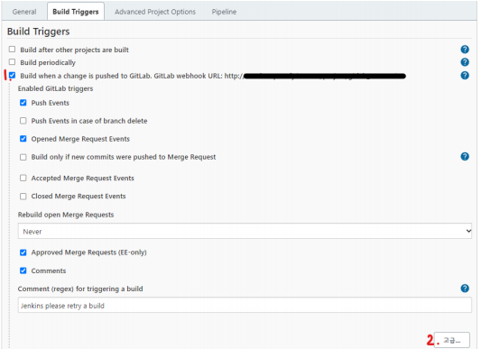

- Secret token을 생성한다.

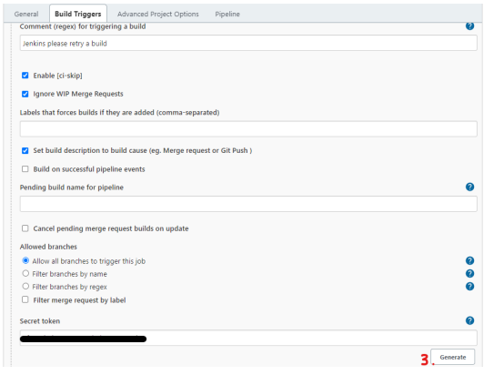

- gitlab에서 Webhook 셋팅 

1. 프로젝트에서 Settings → Integrations 선택
2. URL은 Build Triggers 설정 시 보였던 Gitlab Webhook URL 입력 
3. Secret token은 Build Triggers 설정 시 생성했 던 Secret Token 입력

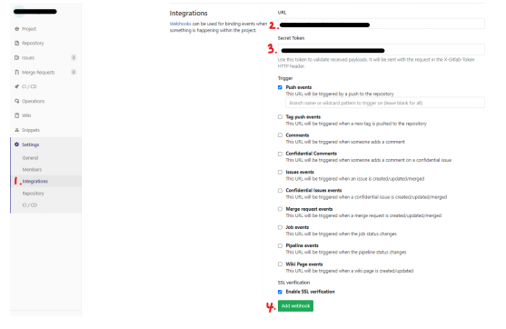


- Webhook 테스트 후 200 리턴 시 정상 작동

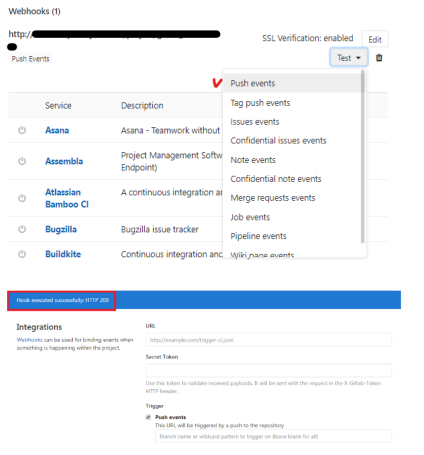


# SSL, TLS 적용

```  shell
sudo apt-get update
sudo apt-get install letsencrypt

sudo letsencrypt certonly --standalone -d [도메인 네임]


 sudo cp /etc/letsencrypt/live/<도메인 네임>/fullchain.pem <볼륨 매핑에 사용될 폴더>  /ssl
 sudo cp /etc/letsencrypt/live/<도메인 네임>/privkey.pem <볼륨 매핑에 사용될 폴더>    /ssl
```


SSL 옮기기 

```shel
$ sudo cp /etc/letsencrypt/live/<도메인 네임>/fullchain.pem <볼륨 매핑에 사용될 폴더>
$ sudo cp /etc/letsencrypt/live/<도메인 네임>/privkey.pem <볼륨 매핑에 사용될 폴더>
```

- /jenkins/workspace/BalTo/frontend/ssl = 볼륨 매핑에 사용될 폴더 - 이거는 frontend Dockerfile COPY 위치와 동일하게 하면된다.


# Reverse Proxy with Docker

1. Docker Network 생성

```shell
sudo docker network create <network이름>
```


2. nginx 설정 파일  `/frontend/nginx/homepage.conf`

SSL을 허용해주어야 한다.  nginx 설정 파일을 작성해준다.

```she
server {
  listen 8000 default_server;
  listen [::]:8000 default_server;

  server_name <도메인 이름>;


  return 301 https://$server_name$request_uri;
}

server {
  listen 8443 ssl;
  listen [::]:8443 ssl;

  server_name i5d103.p.ssafy.io;

  ssl_certificate /ssl/fullchain.pem;
  ssl_certificate_key /ssl/privkey.pem;

  location / {
    alias /usr/share/nginx/html/homepage/;
    try_files $uri $uri/ /index.html;
  }

  location /api {
    proxy_pass http://backend:8080/api;

    proxy_http_version 1.1;

    proxy_set_header Connection "";
    proxy_set_header Host $host;
    proxy_set_header X-Real-IP $remote_addr;
    proxy_set_header X-Forwarded-For $proxy_add_x_forwarded_for;
    proxy_set_header X-Forwarded-Proto $scheme;
    proxy_set_header X-Forwarded-Host $host;
    proxy_set_header X-Forwarded-Port $server_port;

  }

}

```


# mysql

```shell
docker --version 

docker pull mysql:5.7


sudo docker run --name mysql -e MYSQL_ROOT_PASSWORD=<password> -d -p 3306:3306 mysql:5.7

sudo docker ps -a

sudo docker exec -it mysql /bin/bash

show databases;

use <스키마>;
```


``` shell
CREATE DATABASE IF NOT EXISTS ssafy_web_db collate utf8mb4_general_ci;
```


에러 발생 !!! - 네트워크를 지정해주어서 오류를 해결하였다.

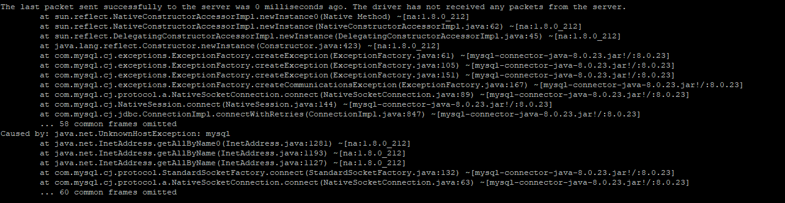

```shell
sudo docker run --name mysql -e MYSQL_ROOT_PASSWORD=ssafyD103! -d -p 3306:3306 --network ssafy_net mysql:5.7
```


# 자동 배포에서 Jenkins 파일 내 Docker 명령어를 찾지 못하는 경우

```shell
sudo docker exec -it jenkins /bin/bash

apt-get update

docker apt-get install docker-ce-cli
```


> 자동배포관련 문서를 참고해서 진행하다보면, Jenkins파일 내의 docker명령어를 찾지못하는 경우가 발생합니다. 해당 문제는 jenkins에서 도커명령어를 찾을 수 없어서 발생하는 문제입니다. 이때 두가지 방법으로 사용할 수 있는데 하나는 볼륨설정, 하나는 젠킨스 내에 docker-cli를 설치해서 사용하는 방법입니다. 볼륨설정으로 하신다면 host의 도커를 사용하기때문에 jenkins 컨테이너에 많은 권한을 주게 됩니다. 그래서 볼륨설정을 하지않고 jenkins 컨테이너 내부에 docker-cli를 설치해서 사용하는 것을 권장드립니다. 
>
> (sudo apt-get install docker-ce-cli)

sudo apt-get install docker-ce-cli

- apt-get update 시 에러 

E : unload docker-ce-cli 

https://kkamagistory.tistory.com/1005 (해결방법)


# Openvidu 서버 배포방법

openvidu on premises 배포 방법

https://docs.openvidu.io/en/2.19.0/deployment/ce/on-premises/

다음 공식문서를 그대로 따라하면 될 것입니다.


# DB 계정

ID : root

PWD : ssafyD103!